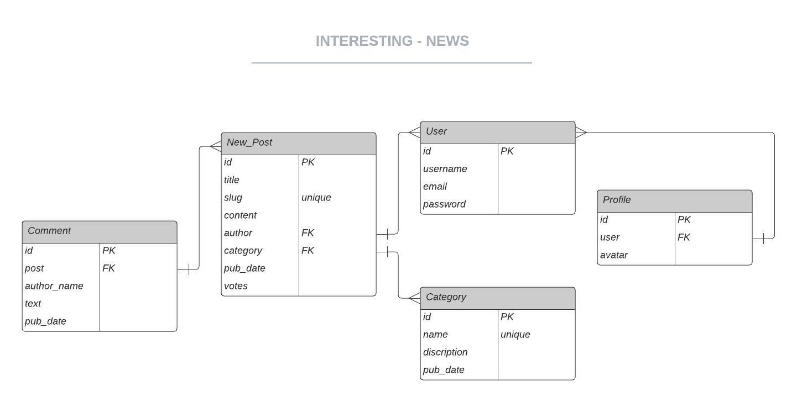

PP4 - Interesting - Your news fix with a classic web 2.0 feel. 

Reasons. 

UX

FEATURES

FUTURE Features

DATABASE - ERD

User:
News_Post: One User can author many News_Posts through a foreign key relationship.
Profile: One User can have one Profile through a one-to-one relationship.
Comment: One User can write comments on many News_Posts (indirect connection through the News_Post model).

Category:
News_Post: Many News_Posts can belong to one Category through a foreign key relationship.

News_Post:
User: One News_Post is written by one User (author foreign key).
Category: One News_Post can belong to one Category (optional).
Comment: One News_Post can have many Comments through a foreign key relationship.

Comment:
News_Post: One Comment belongs to one News_Post (foreign key).
User: One Comment can be written by a User (indirect connection through the News_Post model).

Profile:
User: One Profile belongs to one User (one-to-one relationship).

Entities:

User: Represents a user of the system.
Attributes: id (primary key), username, email, password (hashed), profile (foreign key to Profile).
Profile: Represents a user's profile information.
Attributes: id (primary key), user (one-to-one relationship with User), avatar_url (Cloudinary image URL).
Category: Represents a category for posts.
Attributes: id (primary key), name (unique), description, pub_date.
News_Post: Represents a news post.
Attributes: id (primary key), title, slug (unique), content (HTML text with Cloudinary image URLs), author (foreign key to User), category (foreign key to Category), pub_date, votes.
Comment: Represents a comment on a post.
Attributes: id (primary key), post (foreign key to News_Post), author_name, text, pub_date.
Relationships:

One-to-one: User to Profile
One-to-many:
User to News_Post
Category to News_Post
News_Post to Comment
Many-to-one:
News_Post to Category
Comment to News_Post
Notes:

RESOURCES

LINKS

COMMENTS

CREDITS

