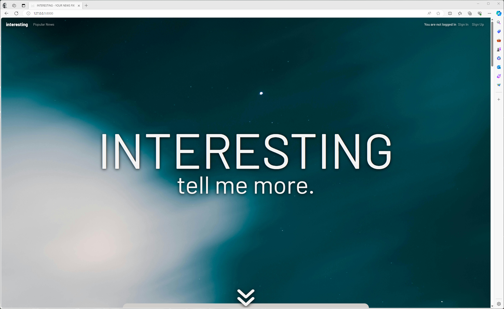
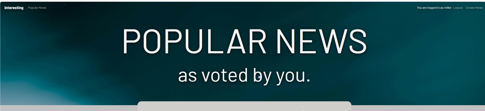
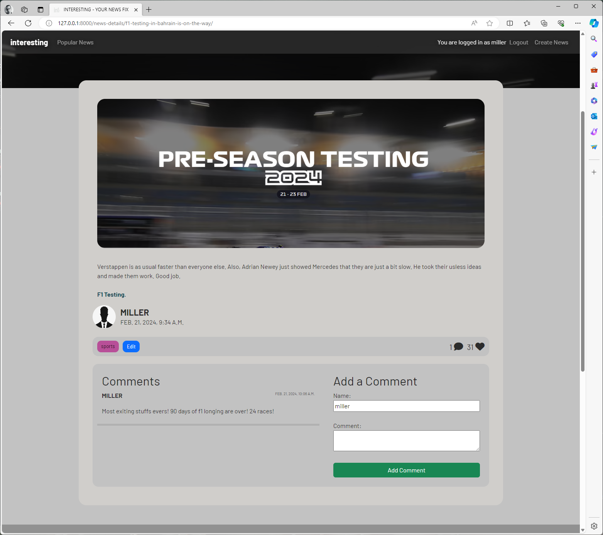
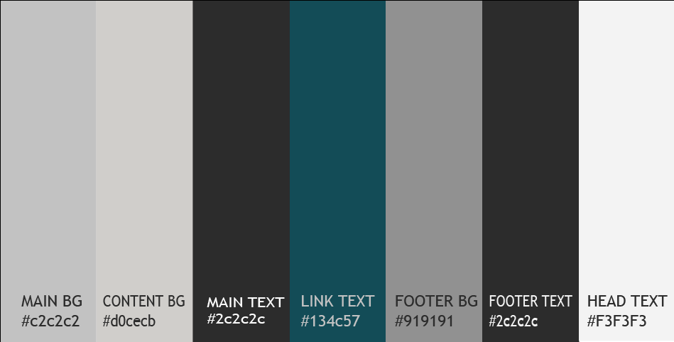
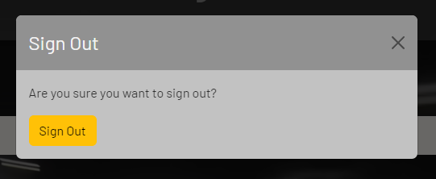

# [PP4 INTERESTING NEWS](https://pp4-interesting-736b0c86bab7.herokuapp.com)

MULTI SCREENSHOT OF SITE. 


Blast from the Web2.0 Past:

Remember the glory days of the early 2000s internet? When user-generated content exploded, dethroning mainstream media and putting the power firmly in our hands? Comments and votes ruled the roost, shaping how news traveled and what stories took center stage. It was a revolutionary time, brimming with the DIY spirit that birthed giants like Reddit, 4chan, 9gag, Digg, and YouTube. 


## UX

Given my nostalgia for a bygone era, I truly aimed to emulate the aesthetics of the mid-2000s – characterized by rounded shapes and muted colors. Everything seemed to exist in blog form during that time.

The menu remains fixed at the top, providing a visual cue for your current status. Initially featuring a fully transparent background, it gradually fades in before any direct content appears beneath it, preventing it from becoming unreadable.

Hero 


Menu  


Popular News


Article


Comments


Footer


### Colour Scheme



- `#636363` used for background.
- `#AAAAA9` used for article background.

- `#636363` used for primary text.
- `#f3f3f3` used for headers and links.

- `#5d5c55` used for footer background.
- `#37382f` used for footer text.


Explain colours. 

### Typography

- [Barlow](https://fonts.google.com/specimen/Barlow) Barlow was chosen for all content.
**Clean and modern:** Its slightly rounded, low-contrast design gives a clean and modern aesthetic. 

- [Font Awesome](https://fontawesome.com) icons were used throughout the site, such as the social media icons in the footer.

## User Stories


### New Site Users

- As a new site user, I would like to create and account, so that I can upload my own news.
- As a new site user, I would like to not create an account, but still see news.
- As a new site user, I would like to vote on news, so that I can show my support.

### Returning Site Users

- As a returning site user, I would like to login, so that I can remove my news.
- As a returning site user, I would like to login, so that I can edit my news.
- As a returning site user, I would like to login, so that I can remove comments on my news.

### Site Admin

- As a site administrator, I should be able to login, so that I can edit all news.
- As a site administrator, I should be able to login, so that I can create profiles.
- As a site administrator, I should be able to login, so that I can remove users.
- As a site administrator, I should be able to login, so that I can remove comments.

## Wireframes


### Mobile Wireframes

<details>
<summary> Click here to see the Mobile Wireframes </summary>

Home
  - 

Popular News
  - 

News Detail 
  - 

Modal Placement
  - 


</details>

### Tablet Wireframes

<details>
<summary> Click here to see the Tablet Wireframes </summary>

Home
  - 

Popular News
  - 

News Detail 
  - 

Modal Placement
  - 


</details>

### Desktop Wireframes

<details>
<summary> Click here to see the Desktop Wireframes </summary>

Home
  - 

Popular News
  - 

News Detail 
  - 

Modal Placement
  - 

</details>

## Features

### Modals
##### Why I chose modals:
- **Simplified user experience:** Modals avoid page reloads, offering a smoother and faster experience for actions like editing data, confirming choices, or viewing previews. This keeps users engaged and focused on the task at hand.
- **Navigation clarity:** With fewer distinct pages, users are less likely to get lost within your application.
- **Development and maintenance efficiency:** Reusable modularity reduces development time and simplifies code maintenance.

##### Considerations:
- **Search engine indexing:** Modal content might not be indexed as effectively as dedicated pages.
- **Responsiveness:** While adaptable, ensure they function well on various screen sizes and devices.

Overall, modals provide a good balance between user experience, development efficiency, and accessibility when designed and implemented thoughtfully.

### Popular news -tab
##### Going beyond "Latest first":
- **User empowerment through voting:** The integrated vote system (represented by a heart icon) allows users to directly influence news visibility, promoting content they appreciate.
- **Accessibility:** No account creation is required, catering to casual news readers who don't need full registration.
- **Engagement and urgency:** The subtle heart animation on hover encourages interaction and creates a sense of dynamic content.

This combination aims to create a more engaging and dynamic news experience while remaining accessible to all users.

[](https://gyazo.com/5996e2971cb332aed73686cebfe8293f)


### Existing Features

- **Welcome screen**


  - A large, bold headline reading **INTERESTING**, with a smaller **tell me more** line underneath, takes center stage to grab the visitor's attention. A bouncing down arrow adds interactivity and movement, further hinting that scrolling down leads to the heart of the fun.

[](https://gyazo.com/2d83f568a96df12d54a5048264917507)

- **Menu - fade in/out**

[](https://gyazo.com/260bbe2e42c8175e400bf93b918e58e4)

  - To avoid being too distracting, the menu has gained the ability to fade in and out based on your position on the screen using JavaScript. The fade-in animation itself is determined in the CSS.
  - [Scroll inspiration](https://stackoverflow.com/questions/23673981/how-to-get-navbar-to-fade-in-and-out#23674172) using variations of different sources, but this whas the one i relied on most.


- **Sign In Modal**


- Using modals for most of the functions, as signing in feelt like the best idea, it removes complexity for the user. 


- **Sign Up Modal**


- Same with signing up, as a user you know exactly where you are and there is no need to go back and fourth throgh pages. 


- **Sign Out Modal**



- Signing out with a modal follows the rest of the rules for navigation. 


- **Create News Modal**


- Even here, a modal works the best, it fits well on screen, and it follows the rest of the site.


- **Edit News Modal**


- I have some thoughts on future features. One option is using Disqus for comment handling. While using a modal aligns with the site's navigation, moderating numerous comments within it might become challenging on smaller screens. This is an aspect to consider for future development iterations.


- **Signed in / Not sign in visual key**

 

- Knowing if you are signed in is important for the user. Some elements change depending on whether you are logged in or not, such as "Sign In/Sign Up" changing to "Sign Out" and the ability to "Create News." However, as a new user, a more straightforward method of knowing your login status might feel more intuitive.


### Future Features

- OpenGraph
    - [Metas OpenGraph](https://opengraph.dev/) I wanted to incorporate Meta's functions for scraping relevant information when you add a link, streamlining content creation. As a user, you would be able to paste your link to the story you want to share, and an image, ingress, and relevant information would be presented automagicly. 

- Disqus
    - [Disqus integration](https://disqus.com/) To make sure the comments are propperly handled, with comment trees and more versitile functions, the use of Disqus would be very beneficial. 

- Dynamic header images for Detail page.
    - I really wanted to use the News Posts image to show in the header for each post. But i could not find an easy way of doing this. The info i found was not a solution for me. I wanted to have it done in css. 
    - [StackOverflow 1](https://stackoverflow.com/questions/34513654/how-do-you-dynamically-display-images-in-django) [StackOverflow 2](https://stackoverflow.com/questions/37574585/django-insert-image-in-a-template-whose-path-is-dynamic)

- VOTE restrictions.
    - As of now, anyone can like/vote on a post as many times as they want. 
    Not the best experience. 


## Tools & Technologies Used

- [HTML](https://en.wikipedia.org/wiki/HTML) used for the main site content.
- [CSS](https://en.wikipedia.org/wiki/CSS) used for the main site design and layout.
- [CSS Flexbox](https://www.w3schools.com/css/css3_flexbox.asp) used for an enhanced responsive layout.
- [CSS Grid](https://www.w3schools.com/css/css_grid.asp) used for an enhanced responsive layout.
- [JavaScript](https://www.javascript.com) used for user interaction on the site.
- [Python](https://www.python.org) used as the back-end programming language.
- [Git](https://git-scm.com) used for version control. (`git add`, `git commit`, `git push`)
- [GitHub](https://github.com) used for secure online code storage.
- [Bootstrap](https://getbootstrap.com) used as the front-end CSS framework for modern responsiveness and pre-built components.
- [Django](https://www.djangoproject.com) used as the Python framework for the site.
- [PostgreSQL](https://www.postgresql.org) used as the relational database management.
- [ElephantSQL](https://www.elephantsql.com) used as the Postgres database.
- [Heroku](https://www.heroku.com) used for hosting the deployed back-end site.
- [VSCode](https://code.visualstudio.com/) used for all local development.
- [Cloudinary](https://cloudinary.com) used for online static file storage.
- [phind](https://www.phind.com/) used for tips and trix, a great way to make progress when stuck.
- [Gemini](https://gemini.google.com/) Used for spell check, and grammar for README and TESTING.
- [PyDot](https://github.com/pydot/pydot) Used for creating ERD
- [ckEditor](https://ckeditor.com/) Used for admin-board and more advanced content creation.
- [SweetAlert](https://sweetalert.js.org/) Used for crud alerts.


## Database Design

```python
    CATEGORIES 
class Category(models.Model):
    """
    Represents a category for posts. Each category has a unique name,
    an optional description, and a publication date.
    """
    name = models.CharField(max_length=100, unique=True)
    description = models.TextField(blank=True)
    pub_date = models.DateTimeField(auto_now_add=True)

    def __str__(self):
        return self.name
```

Model Purpose:
This model represents a category for news posts in your application. Categories can be used to organize and group posts based on their content or theme.

Attributes:
name: This is a character field with a maximum length of 100 characters and is unique, meaning no two categories can have the same name. This ensures clear identification of each category.
description: This is a text field that allows you to add an optional description for the category. This can be used to provide more context or information about the category's content.
pub_date: This is a datetime field that automatically sets the current date and time whenever a new category is created. This can be useful for tracking the creation history of categories.

Additional Method:
__str__: This method defines how the model instance is represented as a string, returning the category name. This is helpful for displaying categories in lists or other contexts.

Key Points:
This model is relatively simple but serves a crucial role in organizing your news posts.
The unique name attribute ensures clear identification of each category.
The optional description field provides additional context for categories.
The pub_date field tracks the creation time of each category.

```python
    NEWS POSTS
class News_Post(models.Model):
    """
    Represents a news post. Each post has a title, rich text content,
    an author, an category, optional image, a publication date,
    and a vote count.
    """
    title = models.CharField(max_length=255)
    slug = models.SlugField(null=True, blank=True, unique=True)
    content = RichTextUploadingField()
    author = models.ForeignKey(User, on_delete=models.CASCADE)
    featured_image = CloudinaryField(
        'image', default=None, null=True, blank=True
    )
    category = models.ForeignKey(
        Category, on_delete=models.SET_NULL, null=True, blank=True
    )
    pub_date = models.DateTimeField(auto_now_add=True)
    votes = models.IntegerField(default=0)

    class Meta:
        db_table = 'news_post'

    def save(self, *args, **kwargs):
        if not self.slug:
            self.slug = slugify(self.title)
            # Unique slug,
            unique_slug = self.slug
            num = 1
            while News_Post.objects.filter(slug=unique_slug).exists():
                unique_slug = f'{self.slug}-{num}'
                num += 1
            self.slug = unique_slug
        super(News_Post, self).save(*args, **kwargs)

    def __str__(self):
        return self.title
```

Model Purpose:
Represents a news post in your application.

Attributes:
title: A character field with a maximum length of 255 characters to store the post title.
slug: A slug field that uniquely identifies each post. It is automatically generated from the title but can be manually edited.
content: A rich text field allowing users to create content with formatting, images, and other features.
author: A foreign key relationship to the User model, indicating the post's author.
featured_image: A Cloudinary field for storing an optional image associated with the post.
category: A foreign key relationship to the Category model, allowing the post to belong to a specific category (optional).
pub_date: A datetime field automatically set to the current time whenever a new post is created.
votes: An integer field storing the number of votes received by the post (initially set to 0).

Additional Methods:
save: This method overrides the default save behavior to ensure unique slugs for each post. It generates a unique slug based on the title if none is provided.
__str__: This method defines how the model instance is represented as a string, returning the post title.

Key Points:
This model uses foreign keys to connect News_Post instances to User and Category models.
The featured_image field uses Cloudinary for image storage and management.
The save method ensures unique slugs for each post.

```python
COMMENTS
class Comment(models.Model):
    """
    Represents a comment on a post. Each comment is linked to a post, may have
    an author name (if the author is unauthenticated), contains text, and has a
    publication date.
    """
    post = models.ForeignKey(News_Post, related_name='comments', on_delete=models.CASCADE)
    author_name = models.CharField(max_length=100, blank=False, null=True)
    text = models.TextField()
    pub_date = models.DateTimeField(auto_now_add=True)

    def __str__(self):
        return f"Comment by {self.author_name or 'Anonymous'} on {self.post.title}"
```

Model Purpose:
This model captures user comments linked to specific news posts in your application.

Attributes:
post: This is a foreign key relationship to the News_Post model, indicating which post the comment belongs to. This allows linking comments to their corresponding news articles.
author_name: This is a character field with a maximum length of 100 characters, storing the name of the comment author. It's set to blank=False and null=True, meaning it cannot be empty but can be null for unauthenticated users.
text: This is a text field containing the actual comment content written by the user.
pub_date: This is a datetime field automatically set to the current date and time whenever a new comment is created, reflecting the comment's creation time.

Additional Method:
__str__: This method defines how a Comment instance is represented as a string. It combines the author name (or "Anonymous" for unauthenticated users) and the title of the associated post for informative display.

Key Points:
This model allows users to leave comments on your news posts.
It captures both authenticated and unauthenticated user comments.
The __str__ method provides a meaningful representation of each comment.

```python
FORM for COMMENTS
class CommentForm(forms.ModelForm):
    """
    A Django form for creating and editing comments.
    """
    class Meta:
        model = Comment
        exclude = ['post']
```

Form Model Purpose:
This form handles user input for creating or editing comments. It allows users to enter the text of their comments without needing to manually specify the associated post, which is automatically handled through the form's relationship with the Comment model.

Form Configuration:
forms.ModelForm: This signifies that CommentForm inherits from the ModelForm class, providing built-in functionality for working with Django models.
Meta: This nested class defines essential options for the form.
model: Specifies the Comment model as the form's basis, ensuring the form fields correspond to model attributes.
exclude: Explicitly excludes the post field from the form. This makes sense since the post is automatically linked based on the context where the form is used (e.g., a specific news post view).

Key Points:
This form simplifies comment creation and editing by handling necessary fields.
Excluding the post field reflects its automatic association within specific views.
This form effectively captures user input for comment content.

```python
PROFILES for USER for USER IMAGE
class Profile(models.Model):
    """
    Represents a user profile.
    Each profile is linked to a user and has an avatar image.
    """
    user = models.OneToOneField(User, on_delete=models.CASCADE)

    avatar = CloudinaryField(
        'image',
        default='avatar',
    )

    def __str__(self):
        return f'{self.user.username} Profile'

    def save(self, *args, **kwargs):
        super().save(*args, **kwargs)
```

Model Purpose:
This model represents a user profile in your application, storing additional information and an avatar image for each user.

Attributes:
user: This is a one-to-one relationship with the User model, indicating that each Profile instance belongs to a unique user. This ensures a single profile per user.
avatar: This is a CloudinaryField storing the user's avatar image URL. It has a default value of "avatar" which could be used as a placeholder image.

Additional Methods:
__str__: This method defines how a Profile instance is represented as a string, combining the user's username and "Profile" for informative display.
save: This method overrides the default save behavior. While its specific purpose isn't explicitly stated, it likely performs additional actions related to the profile image after saving the model instance.

Key Points:
This model allows users to have associated profile information and avatar images.
The one-to-one relationship guarantees a unique profile per user.
Cloudinary is used for image storage and management.


#### User:
Attributes: id (primary key), username, email, password (hashed), profile (foreign key to Profile).
Relationships: One-to-one with Profile, One-to-many with News_Post (as the author), One-to-many with Comment (indirectly through News_Post).

#### Profile:
Attributes: id (primary key), user (one-to-one relationship with User), avatar (Cloudinary image URL).
Relationships: One-to-one with User.

#### Category:
Attributes: id (primary key), name (unique), description, pub_date.

#### News_Post:
Attributes: id (primary key), title, slug (unique), content (RichTextUploadingField), author (foreign key to User), featured_image (Cloudinary image URL), category (foreign key to Category), pub_date, votes.
Relationships: One-to-many with Comment, Many-to-one with Category.

#### Comment:
Attributes: id (primary key), post (foreign key to News_Post), author_name, text, pub_date.
Relationships: Many-to-one with News_Post.

#### Relationships:
One-to-one: 
- User to Profile.

One-to-many:
- User to News_Post (as the author).
- News_Post to Comment.

Many-to-one:
- News_Post to Category.

## Agile Development Process

https://github.com/users/zakenaio/projects/2


### GitHub Projects

[GitHub Projects](https://github.com/zakenaio/pp4-interesting2/projects) served as an Agile tool for this project.
It isn't a specialized tool, but with the right tags and project creation/issue assignments, it can be made to work.

Through it, user stories, issues, and development tasks were planned, then tracked on a weekly basis using the basic Kanban board.


### MoSCoW Prioritization

I've decomposed my Epics into stories prior to prioritizing and implementing them.
Using this approach, I was able to apply the MoSCow prioritization and labels to my user stories within the Issues tab.

- **Must Have**: guaranteed to be delivered (*max 60% of stories*)
- **Should Have**: adds significant value, but not vital (*the rest ~20% of stories*)
- **Could Have**: has small impact if left out (*20% of stories*)
- **Won't Have**: not a priority for this iteration

## Testing

For all testing, please refer to the [TESTING.md](TESTING.md) file.

## Deployment

The live deployed application can be found deployed on [Heroku](https://pp4-interesting-736b0c86bab7.herokuapp.com).

### ElephantSQL Database

This project uses [ElephantSQL](https://www.elephantsql.com) for the PostgreSQL Database.

To obtain your own Postgres Database, sign-up with your GitHub account, then follow these steps:

- Click **Create New Instance** to start a new database.
- Provide a name (this is commonly the name of the project: pp4-interesting2).
- Select the **Tiny Turtle (Free)** plan.
- You can leave the **Tags** blank.
- Select the **Region** and **Data Center** closest to you.
- Once created, click on the new database name, where you can view the database URL and Password.

### Cloudinary API

This project uses the [Cloudinary API](https://cloudinary.com) to store media assets online, due to the fact that Heroku doesn't persist this type of data.

To obtain your own Cloudinary API key, create an account and log in.

- For *Primary interest*, you can choose *Programmable Media for image and video API*.
- Optional: *edit your assigned cloud name to something more memorable*.
- On your Cloudinary Dashboard, you can copy your **API Environment Variable**.
- Be sure to remove the `CLOUDINARY_URL=` as part of the API **value**; this is the **key**.

### Heroku Deployment

This project uses [Heroku](https://www.heroku.com), a platform as a service (PaaS) that enables developers to build, run, and operate applications entirely in the cloud.

Deployment steps are as follows, after account setup:

- Select **New** in the top-right corner of your Heroku Dashboard, and select **Create new app** from the dropdown menu.
- Your app name must be unique, and then choose a region closest to you (EU or USA), and finally, select **Create App**.
- From the new app **Settings**, click **Reveal Config Vars**, and set your environment variables.

| Key | Value |
| --- | --- |
| `CLOUDINARY_URL` | user's own value |
| `DATABASE_URL` | user's own value |
| `DISABLE_COLLECTSTATIC` | 1 (*this is temporary, and can be removed for the final deployment*) |
| `SECRET_KEY` | user's own value |

Heroku needs two additional files in order to deploy properly.

- requirements.txt
- Procfile

You can install this project's **requirements** (where applicable) using:

- `pip3 install -r requirements.txt`

If you have your own packages that have been installed, then the requirements file needs updated using:

- `pip3 freeze --local > requirements.txt`

The **Procfile** can be created with the following command:

- `echo web: gunicorn app_name.wsgi > Procfile`
- *replace **app_name** with the name of your primary Django app name; the folder where settings.py is located*

For Heroku deployment, follow these steps to connect your own GitHub repository to the newly created app:

Either:

- Select **Automatic Deployment** from the Heroku app.

Or:

- In the Terminal/CLI, connect to Heroku using this command: `heroku login -i`
- Set the remote for Heroku: `heroku git:remote -a app_name` (replace *app_name* with your app name)
- After performing the standard Git `add`, `commit`, and `push` to GitHub, you can now type:
	- `git push heroku main`

The project should now be connected and deployed to Heroku!

### Local Deployment

This project can be cloned or forked in order to make a local copy on your own system.

For either method, you will need to install any applicable packages found within the *requirements.txt* file.

- `pip3 install -r requirements.txt`.

You will need to create a new file called `env.py` at the root-level,
and include the same environment variables listed above from the Heroku deployment steps.

Sample `env.py` file:

```python
import os

os.environ.setdefault("CLOUDINARY_URL", "user's own value")
os.environ.setdefault("DATABASE_URL", "user's own value")
os.environ.setdefault("SECRET_KEY", "user's own value")

# local environment only (do not include these in production/deployment!)
os.environ.setdefault("DEBUG", "True")
```

Once the project is cloned or forked, in order to run it locally, you'll need to follow these steps:

- Start the Django app: `python3 manage.py runserver`
- Stop the app once it's loaded: `CTRL+C` or `⌘+C` (Mac)
- Make any necessary migrations: `python3 manage.py makemigrations`
- Migrate the data to the database: `python3 manage.py migrate`
- Create a superuser: `python3 manage.py createsuperuser`
- Load fixtures (if applicable): `python3 manage.py loaddata file-name.json` (repeat for each file)
- Everything should be ready now, so run the Django app again: `python3 manage.py runserver`

#### Cloning

You can clone the repository by following these steps:

1. Go to the [GitHub repository](https://github.com/zakenaio/pp4-interesting2) 
2. Locate the Code button above the list of files and click it 
3. Select if you prefer to clone using HTTPS, SSH, or GitHub CLI and click the copy button to copy the URL to your clipboard
4. Open Git Bash or Terminal
5. Change the current working directory to the one where you want the cloned directory
6. In your IDE Terminal, type the following command to clone my repository:
	- `git clone https://github.com/zakenaio/pp4-interesting2.git`
7. Press Enter to create your local clone.

Alternatively, if using Gitpod, you can click below to create your own workspace using this repository.

[](https://gitpod.io/#https://github.com/zakenaio/pp4-interesting2)

Please note that in order to directly open the project in Gitpod, you need to have the browser extension installed.
A tutorial on how to do that can be found [here](https://www.gitpod.io/docs/configure/user-settings/browser-extension).

#### Forking

By forking the GitHub Repository, we make a copy of the original repository on our GitHub account to view and/or make changes without affecting the original owner's repository.
You can fork this repository by using the following steps:

1. Log in to GitHub and locate the [GitHub Repository](https://github.com/zakenaio/pp4-interesting2)
2. At the top of the Repository (not top of page) just above the "Settings" Button on the menu, locate the "Fork" Button.
3. Once clicked, you should now have a copy of the original repository in your own GitHub account!

### Local VS Deployment

Local Development vs. Heroku Deployment: Key Differences

While developing and testing your application locally can be convenient, the environment is distinct from a live deployment setting like Heroku. Here's a breakdown of the key differences:

1. Logging:
Local: DEBUG mode is True, providing detailed error logs for easier troubleshooting.
Heroku: DEBUG is False to optimize performance and minimize security risks.


2. Database:
Local: You likely use a local database (e.g., SQLite) for convenience.
Heroku: Heroku's Postgres database offers a robust and managed solution for production use.


3. Sensitive Information:
Local: Sensitive data (e.g., SECRET_KEY, DATABASE_URL) might be stored in local configuration files.
Heroku: Store such information securely as environment variables in Heroku, accessible only to your application.


4. Static and Media Files:
Local: These files might be served directly from your local development environment.
Heroku: Services like Cloudinary and Whitenoise ensure efficient and secure delivery of static and media files in production.
By understanding these differences and making the necessary adjustments, you can ensure your application runs smoothly and securely on Heroku, providing a reliable and optimal experience for your users.


## Credits

Sources for help. 

### Content

| Source | Location | Notes |
| --- | --- | --- |
| [Markdown Builder](https://tim.2bn.dev/markdown-builder) | README and TESTING | tool to help generate the Markdown files |
| [WhiteNoise](http://whitenoise.evans.io) | entire site | hosting static files on Heroku temporarily |
| [Gyazo](https://gyazo.com/) | README and TESTING | Tool for creating gif-screenshoots | 
| Code sources |  |  |
| [W3Schools](https://www.w3schools.com/howto/howto_js_topnav_responsive.asp) | Entire site | responsive HTML/CSS/JS navbar |
| [StackOverflow - Menu fade](https://stackoverflow.com/questions/23673981/how-to-get-navbar-to-fade-in-and-out#23674172) | Entire site | making the navmenu fade, also for the arrow |
| [SweetAlert](https://sweetalert.js.org/) | Entire site |  Used for crud alerts |
| [StackOverflow - Votes](https://stackoverflow.com/questions/3722874/jquery-voting-system?rq=1) | Entire site | Very helpful |
| [StackOverflow - Votes](https://stackoverflow.com/questions/3604953/ajax-php-voting-system?rq=1) | Entire site | Also very helpful, more or less the same |
| [CSS Fade Trasitions](https://blog.hubspot.com/website/css-fade-in#text-transition) | Entire site | Crud messages fade out to not distract |


### Media

| Source | Location | Type | Notes |
| --- | --- | --- | --- |
| [Pexels](https://www.pexels.com) | entire site | image | favicon on all pages |

### Acknowledgements

- I would like to thank my Code Institute mentor, [Tim Nelson](https://github.com/TravelTimN) for their support throughout the development of this project.
- I would like to thank the [Code Institute](https://codeinstitute.net) tutor team for their assistance with troubleshooting and debugging some project issues.
- I would like to thank the [Code Institute Slack community](https://code-institute-room.slack.com) for the moral support; it kept me going during periods of self doubt and imposter syndrome.
