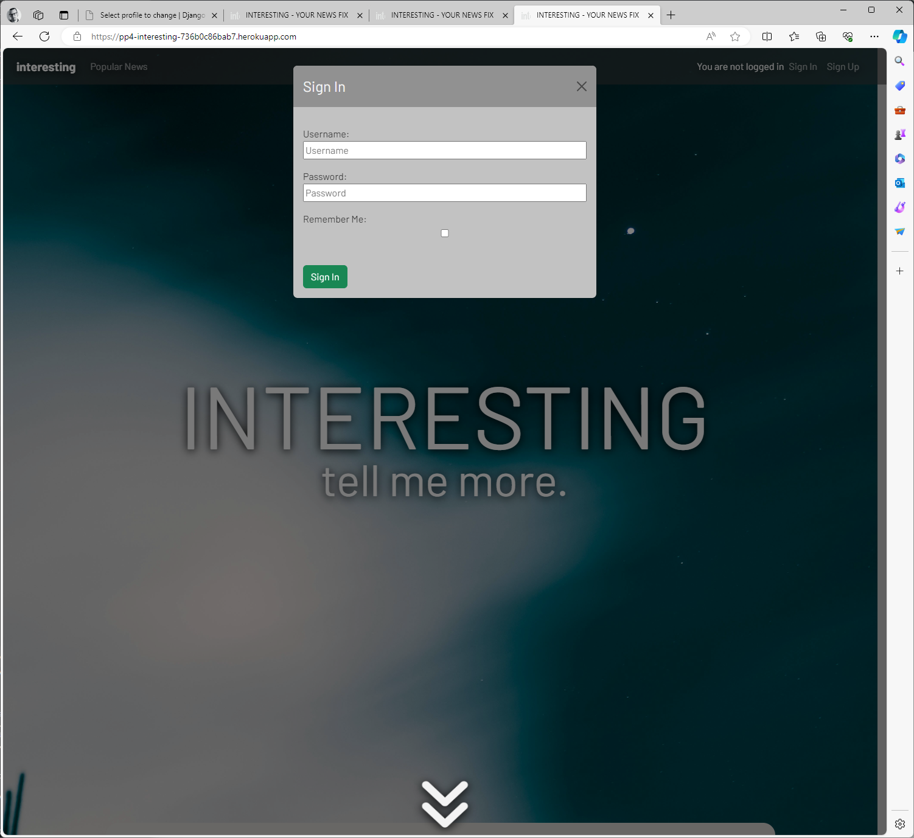
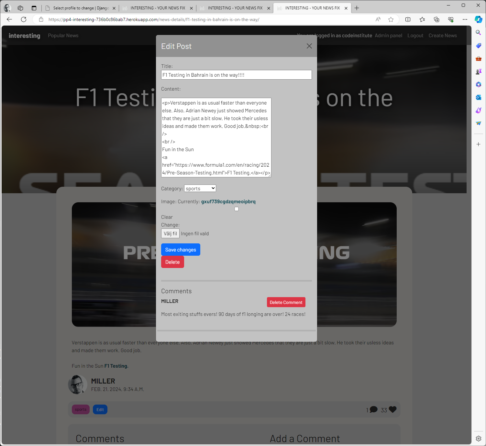
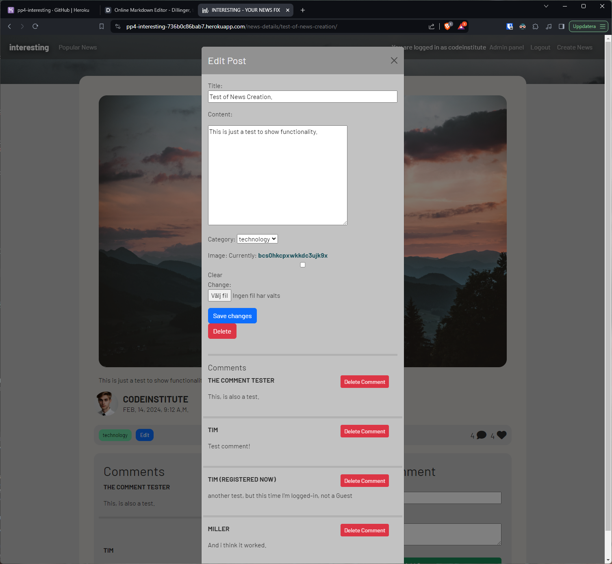
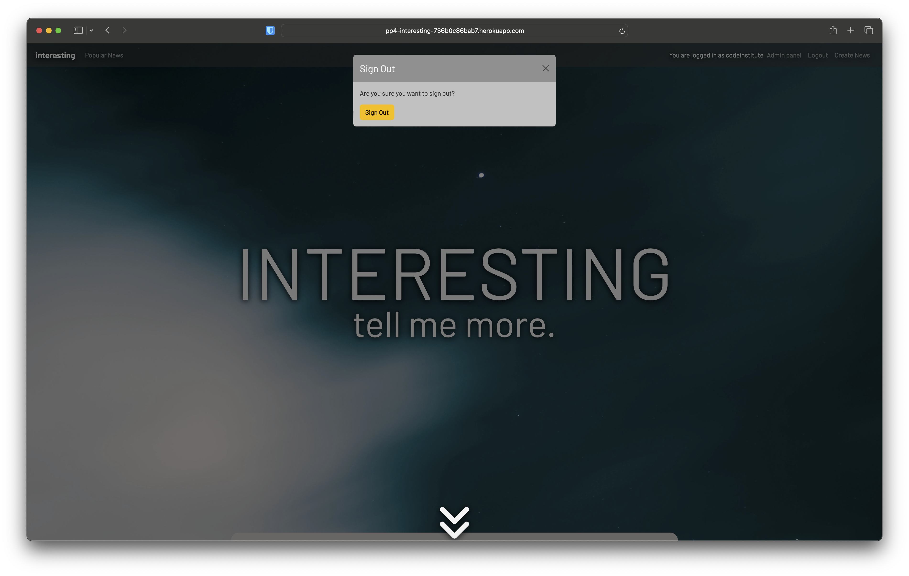

# Testing

Return back to the [README.md](README.md) file.

## Code Validation

### HTML

I have used the recommended [HTML W3C Validator](https://validator.w3.org) to validate all of my HTML files.

- If you are copying/pasting your HTML code, use this link: https://validator.w3.org/#validate_by_input
- (*recommended*) If you are using the live deployed site pages, use this link: https://validator.w3.org/#validate_by_uri

- https://validator.w3.org/nu/?doc=https%3A%2F%2Fzakenaio.github.io%2Fpp4-interesting2%2Findex.html

| Page | W3C URL | Screenshot | Notes |
| --- | --- | --- | --- |
| Home | [W3C](LINK TO W3VALIDATION) |  |  |
| Popular | [W3C](LINK TO W3VALIDATION) |  |  |
| Detail page | [W3C](LINK TO W3VALIDATION) |  |  |

### CSS

I have used the recommended [CSS Jigsaw Validator](https://jigsaw.w3.org/css-validator) to validate all of my CSS files.

| File | GitHub URL | Screenshot | Notes |
| --- | --- | --- | --- |
| style.css | [Link to CSS on GitHub](https://github.com/zakenaio/pp4-interesting2/blob/main/static/css/style.css) |  | Pass: No Errors |

### JavaScript

I have used the recommended [JShint Validator](https://jshint.com) to validate all of my JS files.

| File | Screenshot | Notes |
| --- | --- | --- |
| script.js |  | |

### Python

`# noqa` = **NO Quality Assurance**

**NOTE**: You must include 2 *spaces* before the `#`, and 1 *space* after the `#`.

I have used the recommended [PEP8 CI Python Linter](https://pep8ci.herokuapp.com) to validate all of my Python files.

| File | GitHub URL | Screenshot | Notes |
| --- | --- | --- | --- |
| interesting/admin.py | URL |  |  |
| interesting/settings.py | URL |  | used # noqa for long lines on five places, all regarding long lines as secret-keys and such. |
| interesting/urls.py | URL |  | used # noqa for long lines once.  |
| news/admin.py | URL |  |  |
| news/apps.py | URL |  |  |
| news/context_processors.py | URL |  |  |
| news/forms.py | URL |  |  |
| news/models.py | URL |  |  |
| news/urls.py | URL |  |  |

## Browser Compatibility

MUST TEST BROWSERS! MUJMUJIMPORTANTE

I've tested my deployed project on multiple browsers to check for compatibility issues.

| Browser | Home | Popular News | Detail | Modals Signed out | Modals Signed In | Notes |
| --- | --- | --- | --- | --- | --- | --- |
| Edge Windows11 |  |  |  |   |    | Works as expected |
| Brave Windows11 |  |  |  |   |    | Works as expected |
| Safari macOS |  |  |  |   |    | Works as expected |
| Brave macOS |  |  |  |   |    | Works as expected |
| FireFox Linux |  |  |  |  | --- | Works as expected |

## Responsiveness

MUST TEST ON REAL AND DEVTOOLS! 

I've tested my deployed project on multiple devices to check for responsiveness issues.

| Device | Home | About | Contact | etc | Notes |
| --- | --- | --- | --- | --- | --- |
| Desktop |  |  |  |  | Works as expected |
| Macbook |  |  |  |  | Works as expected |
| Tablet |  |  |  |  | Works as expected |
| Pixel 3 |  |  |  |  | Works as expected |
| iPhone X |  |  |  |  | Works as expected |
| Devtools Small |  |  |  |  | Works as expected |
| Devtools Medium |  |  |  |  | Works as expected |
| Devtools Large |  |  |  |  | Works as expected |

## Lighthouse Audit

SCREENS OF EVERY TEST! 
TEST EVERY PAGE! 

Problem with Lighthouse Audit with cloudinary not using https 
https://stackoverflow.com/questions/51884586/force-cloudinary-urls-to-use-https
https://community.cloudinary.com/discussion/484/my-urls-are-returned-in-the-http-instead-of-https

I've tested my deployed project using the Lighthouse Audit tool to check for any major issues.

| Page | Mobile | Desktop | Notes |
| --- | --- | --- | --- |
| Home |  |  | Some minor warnings |
| About |  |  | Some minor warnings |
| Gallery |  |  | Slow response time due to large images |
| x | x | x | repeat for any other tested pages/sizes |

## Defensive Programming

Defensive programming was manually tested with the below user acceptance testing:

| Page | Expectation | Test | Result | Fix | Screenshot |
| --- | --- | --- | --- | --- | --- |
| Home | | | | | |

MAYBE JUST USE THE ABOVE! 

| Page | User Action | Expected Result | Pass/Fail | Comments |
| --- | --- | --- | --- | --- |
| Home | | | | |
| | Click on Logo | Redirection to Home page | Pass | |
| | Click on Home link in navbar | Redirection to Home page | Pass | |
| Sign Up | | | | |
| | Click on Sign Up button | Redirection to Sign Up page | Pass | |
| | Enter valid email address | Field will only accept email address format | Pass | |
| | Enter valid password (twice) | Field will only accept password format | Pass | |
| | Confirm email | Redirects user to blank Sign In page | Pass | |
| Log In | | | | |
| | Click on the Login link | Redirection to Login page | Pass | |
| | Enter valid email address | Field will only accept email address format | Pass | |
| | Enter valid password | Field will only accept password format | Pass | |
| | Click Login button | Redirects user to home page | Pass | |
| Log Out | | | | |
| | Click Logout button | Redirects user to logout page | Pass | Confirms logout first |
| | Click Confirm Logout button | Redirects user to home page | Pass | |
| repeat for all remaining pages | x | x | x | x |

## User Story Testing

DONT FORGET THIS! 

| User Story | Screenshot |
| --- | --- |
| As a new site user, I would like to ____________, so that I can ____________. |  |
| As a new site user, I would like to ____________, so that I can ____________. |  |
| As a new site user, I would like to ____________, so that I can ____________. |  |
| As a returning site user, I would like to ____________, so that I can ____________. |  |
| As a returning site user, I would like to ____________, so that I can ____________. |  |
| As a returning site user, I would like to ____________, so that I can ____________. |  |
| As a site administrator, I should be able to ____________, so that I can ____________. |  |
| As a site administrator, I should be able to ____________, so that I can ____________. |  |
| As a site administrator, I should be able to ____________, so that I can ____________. |  |
| repeat for all remaining user stories | x |

## Database tests 
Creating News test. 

 
 

Login test. 

 

Vote system test.

 

## Bugs

During the development i encountered several bugs and problems, during development i seldome remember to take a screenshot, I just try to solve it, so if its just frontend glitches, or backend. 

 

I had way to many of these, things where installed, i could use them. But i just was not able to use it in my venv, reboots, new venv, nothing worked. But after an update of VScode solved it. Note to self, always update! 

Make sure you do your js the right way!

 

The function to prepopulate the edit Modal played tricks on me on several occations. Way to often it was just I who had placed a csrf_token wrong, or used the wrong post_form.as_p. 
The differance between using {%  or {{ was something i apparently found harder than i first thoght. 
This was also triggered by puting for loops and endfor in the wrong div.

### GitHub **Issues**

NEED TO MAKE THIS! 

An improved way to manage bugs is to use the built-in **Issues** tracker on your GitHub repository.
To access your Issues, click on the "Issues" tab at the top of your repository.
Alternatively, use this link: https://github.com/zakenaio/pp4-interesting2/issues

If using the Issues tracker for your bug management, you can simplify the documentation process.
Issues allow you to directly paste screenshots into the issue without having to first save the screenshot locally,
then uploading into your project.

You can add labels to your issues (`bug`), assign yourself as the owner, and add comments/updates as you progress with fixing the issue(s).

Once you've sorted the issue, you should then "Close" it.

When showcasing your bug tracking for assessment, you can use the following format:

**Fixed Bugs**

All previously closed/fixed bugs can be tracked [here](https://github.com/zakenaio/pp4-interesting2/issues?q=is%3Aissue+is%3Aclosed).

| Bug | Status |
| --- | --- |

Any remaining open issues can be tracked [here](https://github.com/zakenaio/pp4-interesting2/issues).

| Bug | Status |
| --- | --- |
| [JS `'let'` or `'const'` or `'template literal syntax'` or `'arrow function syntax (=>)'` is available in ES6 (use `'esversion: 11'`) or Mozilla JS extensions (use moz).](https://github.com/zakenaio/pp4-interesting2/issues/4) | Open |
| [Python `E501 line too long` (93 > 79 characters)](https://github.com/zakenaio/pp4-interesting2/issues/5) | Open |

## Unfixed Bugs

| Bug | Status |
| --- | --- |
| Using django links in some modals | Noticed that i had hardcoded links in some of my modals, after trying to fix the issue some of my modals broke, curtain faded but no modal was shown, i could not seem to resolve the issue at this point. | 
